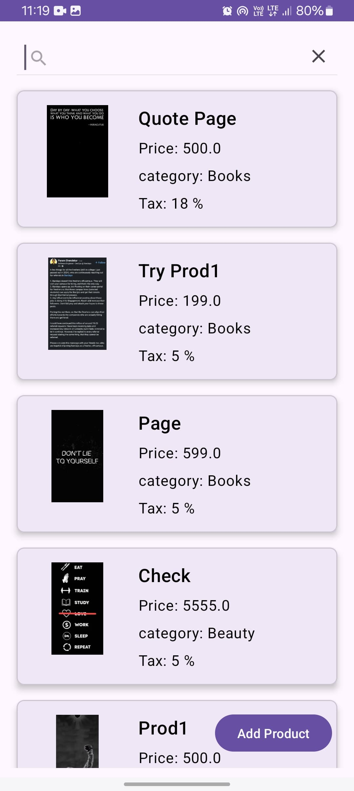
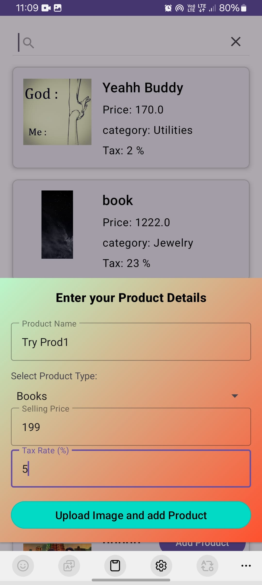
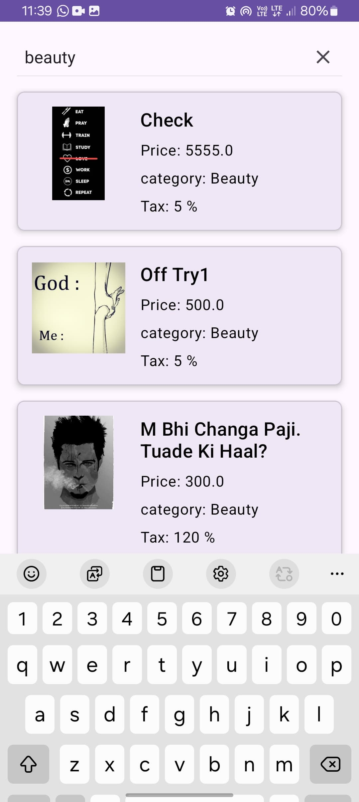

# Products App

## Overview

The Products App is an Android application designed to manage a list of products. It allows users to
add, search, and view products with details such as name, type, price, and tax. The app **uses
modern
Android development practices, including MVVM architecture,Retrofit for rest api calls, LiveData,
ViewModel, koin for DI, splash
API for splash screen, jetpack navigation components, and WorkManager for background tasks**.

## Detailed Project Structure

### 1. `src/main/java/com/akashsoam/productsapp`

- **`MainActivity.kt`**: The main activity that hosts the fragments.
- **`ui/frags`**: Contains the fragments used in the app.
    - **`ProductListFragment.kt`**: Displays the list of products and handles search functionality.
    - **`AddProductBottomSheetDialogFragment.kt`**: A bottom sheet dialog for adding new products.
- **`adapters`**: Contains the adapter for the RecyclerView.
    - **`ProductAdapter.kt`**: Adapter for displaying products in a RecyclerView.
- **`models`**: Contains the data models.
    - **`Product.kt`**: Data class representing a product.
- **`repository`**: Contains the repository classes.
    - **`ProductRepository.kt`**: Handles data operations for products.
- **`viewmodels`**: Contains the ViewModel classes.
    - **`ProductViewModel.kt`**: ViewModel for managing product data.
- **`util`**: Contains utility classes.
    - **`Resource.kt`**: A generic class for handling data with status.
    - **`workers`**: Contains the WorkManager workers.
        - **`SyncProductsWorker.kt`**: Worker for syncing products with the server.

### 2. `src/main/res/layout`

- **`activity_main.xml`**: Layout for the main activity.
- **`fragment_product_list.xml`**: Layout for the product list fragment.
- **`fragment_add_product_bottom_sheet_dialog.xml`**: Layout for the add product bottom sheet
  dialog.
- **`item_product.xml`**: Layout for individual product items in the RecyclerView.

### 3. `src/main/res/values`

- **`colors.xml`**: Defines the color resources.
- **`strings.xml`**: Defines the string resources.
- **`styles.xml`**: Defines the style resources.

## Features

- **Add Product**: Allows users to add new products with details such as name, type, price, and tax.
- **Search Product**: Users can search for products by name.
- **View Products**: Displays a list of products with their details.
- **Sync Products**: Syncs unsynced products with the server using WorkManager.

## Installation

1. Clone the repository:
   ```sh
   git clone https://github.com/soam1/products-app.git
   ```
2. Open the project in Android Studio.
3. Build the project to download dependencies.
4. Run the app on an emulator or physical device.

## Usage

1. Launch the app.
2. Use the search bar to search for products.
3. Click the "Add Product" button to add a new product.
4. View the list of products in the main screen.

## Dependencies

- **AndroidX Libraries**: For modern Android development.
- **Material Components**: For UI components.
- **Lifecycle Components**: For ViewModel and LiveData.
- **WorkManager**: For background tasks.
- **Retrofit**: For network operations.
- **Room**: For local database operations.

## Contributing

1. Fork the repository.
2. Create a new branch (`git checkout -b feature-branch`).
3. Make your changes.
4. Commit your changes (`git commit -m 'Add some feature'`).
5. Push to the branch (`git push origin feature-branch`).
6. Open a pull request.

## Sample Images

Below are a few screenshots that highlight different aspects and features of the Products App. These images provide a glimpse into the user interface and functionality, including the product listing, addition of new products, and the search using product name or category feature.

### Product Listing


### Add Product Dialog


### Search Functionality


These images are intended to give a quick overview of the app’s capabilities and user interface.

## Demo Video


## License

This project is licensed under the MIT License. See the `LICENSE` file for more details.

## Contact

For any inquiries or issues, please contact [soam1](https://github.com/soam1).